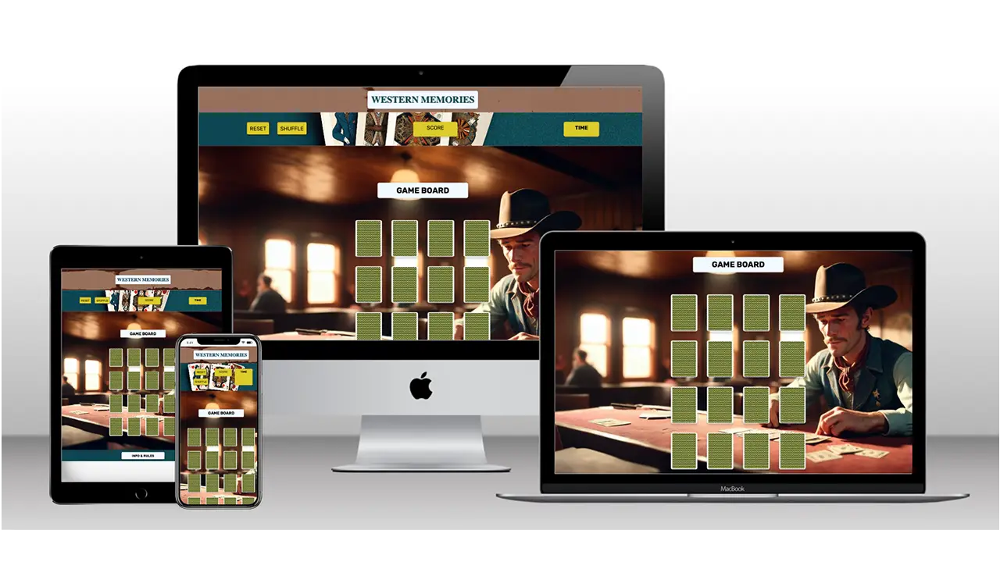
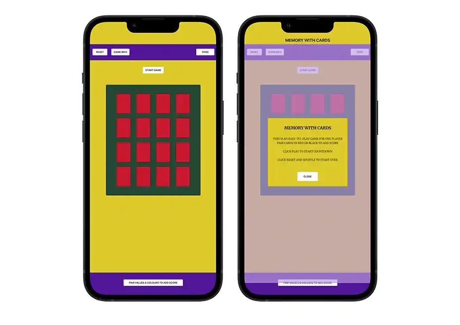
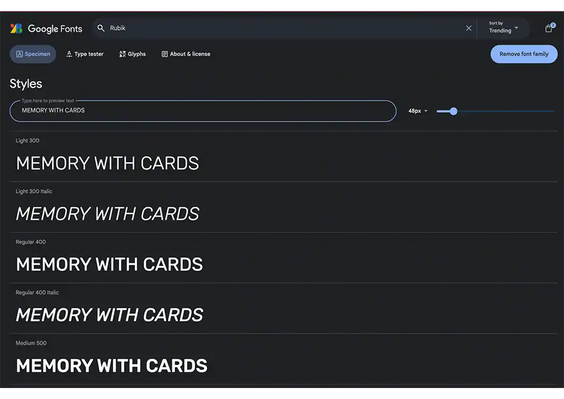
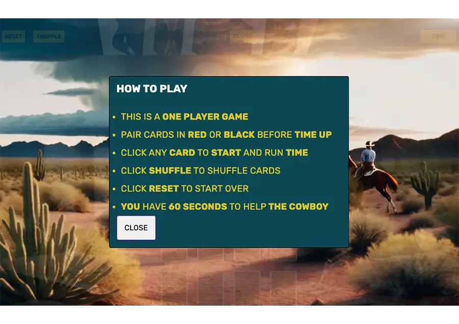
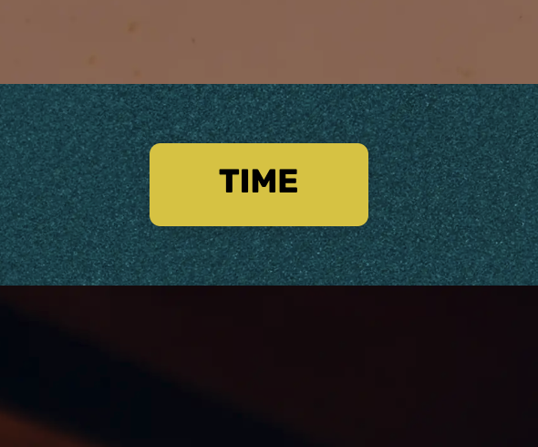
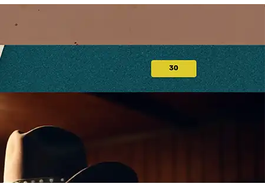
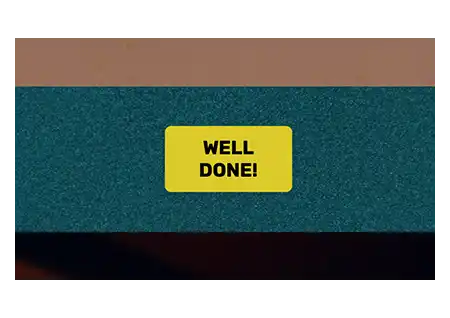
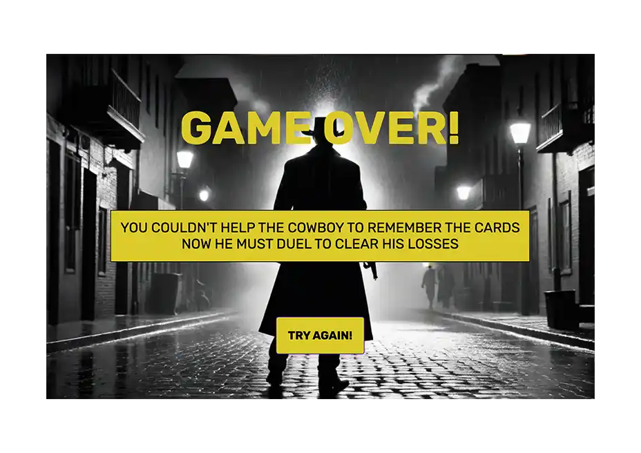
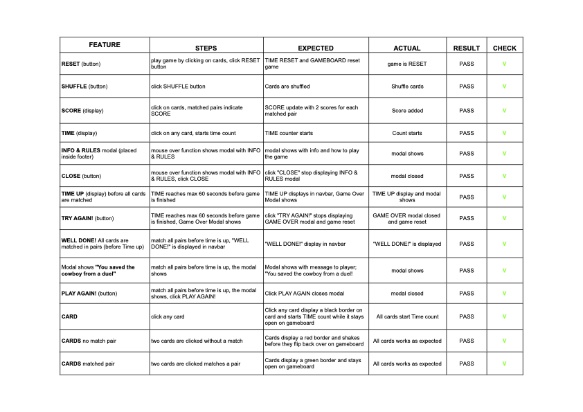

# WESTERN MEMORIES

[View live project here on Github Pages](https://tjcaj.github.io/western_memories/)

WESTERN MEMORIES is a fun matching card game built with HTML, CSS, and JavaScript. The aim of the game is to enjoy playing with playing cards in a non-competitive, relaxed environment where the goal is to match as many pairs as you can withinn a specified time-frame and with the same value and colour in RED or BLACK. Hence _Diamonds_ and _Hearts_ are considered matching pairs, as well as _Clover_ and _Spades_. This is my first JavaScript project built for the Code Institute's Full Stack Software Development course.

 

* [UXD (User Experience Design)](#user-experience-ux)
  * [User Stories](#user-stories) 
  * [Wireframes](#wireframes)
* [Design](#design)
  * [Colour Scheme](#colour-scheme)
  * [Typography](#typography)
  * [Imagery](#imagery)
  * [Accessibility](#accessibility)
* [Future Features](#future-features)
* [Technologies Used](#technologies-used)
  * [Languages Used](#languages-used)
  * [Technologies & Programs Used](#technologies--programs-used)
* [Deployment](#deployment)
* [Testing](#testing)  
  * [Bugs](#bugs)
* [Credits](#credits) 

## User Experience (UX)

### **User Stories**

### **Primary Goal**

WESTERN MEMORIES is an online memory card game styled in a classic western theme with a clean but visually interesting and user friendly design. It is suitable for all ages. The game aims to provide a relaxed, memory-enhancing experience and test your memory ability under time pressure.

### **User/Visitor Goals**

WESTERN MEMORIES has been designed to be easily accessible and fun for all ages. It is a grid-style card game where the user is expected to flip as many matching cards as possible and keep them locked before the time is up. This is testing the users memory skills. Design and styling is responsive to different media screen sizes. A preset timer iniates a counter as the user clicks a card. When the time is up a message of _Time up_ or _Well done_ is displayed for the user.

### **First-Time User/Visitor**

  - As a first-time user, I want to know the rules of the game.
  - As a first-time user, I want to choose when to start the game.
  - As a first-time user, I want to test my ability and improve my progress.
  - As a first-time user, I want positive feedback when I complete the game.

### **Returning User/Visitor**

  - As a returning user, I want to be able to play the game again and again.
  - As a returning visitor, I want to be able to play the game on different devices.
  - As a returning visitor, I want to be able to reset the game screen quickly if I share it with another user for their try.
  
   

---  

## Creation Process

### **1. Strategy**

My goal was to build an interactive, memory game suitable for all ages. I wished to use selected values from a deck of cards to set up an easy and familiar styling of the game. The theme is also to some extent a follow-up to my previous PP1 project in mind, where created website for a poker club. I would like to see this as continuation and learn how to create various games adapted for such a website.

  - The user will able to familiarise themselves with the game rules before starting to play. 

### **2. Scope**

The game must be responsive and playable on mobile, tablet, and desktop-sized devices.

### **3. Structural** 

  - The player is informed of the rules from a modal window easy accessible via a _Rules & Info_ element in the Header, through a mouse-over function.
  - Buttons gives the player option shuffle cards, reset and start time countdown via an initial click on any card.
  - The layout and design of the gameboard does not change much between screen sizes to keep the experience consistent.

### **4. Skeleton**

The game site will have a clean layout with every feature identifiable and interactive.

  - On loading, the page display the gameboard with 16 cards already shuffled. A preset timer of 60 seconds will automatically begin to count as user clicks any card.
  - The gameboard is situated in the center of the screen with the size of 4x4 gamecards displayed.
  - _Time/counter_ are located above the gameboard to the right in the navbar.
  - A _Reset_ button is located to the left, next to the _Shuffle_ button.
  - A message of "TIME UP" is displayed where the _Time_ is also displayed. 

  ### **Wireframes**  
  
The wireframes were created in Figma.

Wireframe - Desktop main window

Wireframe - Desktop Game Info modal window

Wireframe - Mobile Main and Game Info modal window

   

## Design

### **Colour Scheme**

I initially used my own preferences to to select colours with clean and distinctive colours in order to to create the gameboard palette with clear contrasts and a user friendly experience. Then I further accentuated my choice of colours after creating the main background image with a free ai text to image generator from Freepik. The image was then uploaded to extract the Adobe colour scheme that I've used for the entire layout.

_Colour palette for the gameboard_

 

### **Typography**  

I chose the serif font 'Rubik' from [Google Fonts](https://fonts.googleapis.com/css2?family=Rubik+Mono+One&family=Rubik:ital,wght@0,300..900;1,300..900&display=swap) i find the the font clean and easy to read, therefore it is used throughout the project.

### **Imagery**

I wished to use a wellknown and a familiar card style. After some research I gathered a selection of copyright-free images used in a previous PP2 project by Chris Watton that I found via Slack and a peer-code-review. This is a repository by the developer [ImKennyYip](https://github.com/ImKennyYip/black-jack). That is originally a tutorial for a Blackjack card game. My own creation added to this, is the backside of the cards which I created via [MagicPattern](https://www.magicpattern.design/tools/css-backgrounds)

 

### **Accessibility**

Adobe Color Accessibility Tools was used to check for colour blind safeness in the colour palette. High Contrast levelswere important to achieve.

---

## Website Features

### **1. Game Board**
  

The gameboard greets the user when the page first loads. It is a 4x4 grid-style gameboard. A classic yellow and blue card pattern decorates the back of the cards. Cards are flipped, one at a time, revealing original card values with jack, queen, king and aces. Matched cards stay facing up witha green border to indicate success. Unmatched cards shake briefly with a red border and flip back over. A 'Reset' button is present to reset the game experience for the current player or set it up for a new player.

 

### **2. Game Info Modal** 
  

This modal is integrated in the Header as a menu option and details the game rules. Pressing the 'Close' button takes te player back to the gameboard.

 
  
### **3. Timer**

The timer starts when the user click on any card on the gameboard and works as a reversed countdown. As it reaches the end of the preset time intervall of 60 seconds, it either displays _TIME UP!_ or _"WELL DONE!_ depending on the players success or failure. In case the user fails to match all cards, a Game Over modal pops up with a message of; _"You couldn't help the cowboy remember the cards. Now he must duel to clear his name."_ This is to motivate the player to play again. Clicking the _Reset_ button inside the modal, allows the player to start over, click Reset and Shuffle before playing again by clicking on any of the cards on the gameboard. But if the player manage to match all cards within the time intervall another modal pops up with a mesage of; _"You saved the Cowboy from a duel!"_ and a choice to click a _Play again!_ button.

 

## Future Features

- As future features I wish to add the option to change level and try an easier or a more difficult version, with various time intervalls and adding more cards to the gameboard with options of 16, 24 and 36 cards. This will improve the gaming experience as it gives the user more ways to challenge his/her memory skills. But this was beyond the scope of this version and will be included in the next version.

- This will allow the user to develop their memory skills by advancing in levels and improve with shorter time intervalls. A responsive modal or menu can offer optional settings. 

- In addition, I would also like to add the feature for all players with an option to enter "player's name" to personalise the gameboard. As well as to include a scoreboard with the top five results by the players' names entered. This will appeal to the more competitive players and enhance the gaming experience. 

---  

## Technologies Used

### **Languages Used**

- HTML5
- CSS3
- JavaScript

### **Technologies & Programs Used** 

- Figma - used to produce wireframes 
- GitHub - used to save and store all files for this website  
- Git - used for version control
- Google Fonts - fonts were imported from here 
- Favicon - icon were edited and downloaded from here 
- magicpattern.design - to create new pattern on playing card back view
- freepik.com - to generate images with text for the overall visual impression of the western theme
- Adobe Color - for all color palettes and accessibility color testing
- Adobe Photoshop to compress and convert images to Webp format
- Google Dev Tools - to debug and for testing responsiveness 
- Google Lighthouse - for auditing the website
- W3C Validator - for validating the HTML and CSS code 
- JSHint - for validating JavaScript

---

## Deployment

### **How to deploy**  

GitHub was used to deploy the website. These were the steps taken to achieve this:  

1. Login to GitHub account.
2. Navigate to the project repository, [western_memories](https://github.com/TJCAJ/western_memories).
3. Click the Settings button near the top of the page.
4. In the left-hand menu, find and click on the Pages button.
5. In the Source section, choose 'main' from the drop-down, and select branch menu.
6. Select 'root' from the drop-down folder menu.
7. Click 'Save' and after a few moments the project will have been made live and a link is visible at the top of the page.

 

### **How to run this project locally**  

To clone this project from GitHub:  

1. Visit the [Western Memories repository]().
2. Click on the <b>Code</b> dropdown menu located beside the green <b>GitPod</b> button. 
3. Choosing your preferred cloning option of <b>HTTPS, SSH</b> or <b>GitHub CLI</b>, click on the clipboard icon to copy the displayed URL. 
4. Open the terminal in your code editor and change the working directory to the location that you wish to use for the cloned directory.
5. Type 'git clone' into the terminal, paste your copied link, and press enter.

   

### **To fork the repository on GitHub** 
  
To make a copy of this GitHub repository that allows you to view the content and make changes without affecting the original repository, please take the following steps:
  
1. Login to <b>GitHub</b> and find [this repository](https://github.com/TJCAJ/western_memories).
2. Locate the <b>Fork</b> button on the top, right hand side of the page.
3. Click on the <b>Fork</b> button to create a copy of the repository in your GitHub account.

   

---

## Testing
  
### **Initial tests**  
  
The primary goal for this project was for me to learn the basis of Javascript and to create a responsive game web application that delivers a positive experience for the user. I have used Chrome Dev Tools to test the game. Using the console and JSHint to debug JavaScript was new to me, but will surely be something that I will continue to use. I choosed to deploy my page late in the development process this time, to ensure that I had the ability to understand javascript better and could test my skills first, without having to commit all the time while I was still very much in a learning curve. This is why I have commits with some larger chunks of code in the beginning of the build, that I used from a locally stored version on my computer. I will also most likely continue to work locally first and develop my next projects before setting up new repositorys on Github.
  
- Macbook Pro (5120 X 2880)  
- LG HDR 4K" Monitor (3840x2160)
- iPad Pro 2021
- iPhone 12 Pro

Popular device testing on Chrome Dev Tools

On desktop, the browsers that I had access to for testing were:

- <b>Chrome</b>
- <b>Safari</b> 

The results of feature testing in <b>Chrome</b>, <b>Firefox</b>, <b>Edge</b> and <b>Safarai</b> are as follows:

  
   
  

### **Bugs** 

 - Fixed double click shows matched pairs when card clicked twice - My Mentor Gareth Mc Girr.

  

### **Validation**
  
The [W3C Validator](https://validator.w3.org/) was used to validate HTML and the CSS file was validated in the [Jigsaw W3C validator](https://jigsaw.w3.org/css-validator/). [JSHint](https://jshint.com/) was used to validate the JavaScript file. Below are the records of these validations:  
  

W3C HTML Validation - no errors or warnings to show 

  

W3C Jigsaw CSS Validation - no errors found

  

JSHint for JavaScript validation - no errors found. 

  

Lighthouse Scores for Desktop

  
 

Lighthouse Scores for Mobile - performance optimised by using already compressed .png files.

  

WAVE report for accessibility

  

    
---
  

## Credits

### **Content References**

  ### All content created is copyright-free resources and is intended for educational purposes.

  - [Code Institute](https://codeinstitute.net/ie/) for their HTML/CSS/JavaScript learning material.

  - [W3Schools](https://www.w3schools.com/) for additional learning material overall.

  - [Web Dev Simplified](https://www.youtube.com/WebDevSimplified) Youtube channel for coding tutorials and guidance.
      - [javascript simplified](https://javascriptsimplified.com/) Web Dev Simplified learning javascript.
      - [javascript simplified](https://javascriptsimplified.com/) Modal Walkthrough

  - [Code Grind](https://www.youtube.com/@CodeGrind) setup memory game with matching pairs tutorial.

  - [Distansakademin](https://www.youtube.com/watch?v=-2gG6WPhbC0&list=PLI5JF23TK_8D5p-MY4CvvpY7_zMUccsE8&index=1) 
      - Swedish Youtube channel for web development and basics in HTML, CSSS and Javascript.

  - [Coding Nepal](https://www.codingnepalweb.com/build-memory-card-game-html-javascript/) for inspiration and the idea of using an <ul> list of images to achieve the shuffle function in JavaScript.

 

### **Media References**

  - [ImKennyYip](https://github.com/ImKennyYip/black-jack), playing cards.

  - [Favicon](https://favicon.io/) for the favicon used for this site.

  - [Freepik](https://www.freepik.com/pikaso) for creating images from my own text input with their ai text to image generator.

  

### **Acknowledgements**  
  
I would like to thank my mentor Gareth Mc Girr for his continued guidance and expertise,  
my fellow classmates and Cohort Facilitator Kristyna Wach as well as the extended Code Institute Slack community where I found many answers to my questions just by searching previous threads. Especially my classmate Marceillo De Wet, who kindly reached out to me and helped me understand the basic of javascript better in a friendly and inspirational one to one session via Huddle. And of course my family for their support during my long hours of studies.
